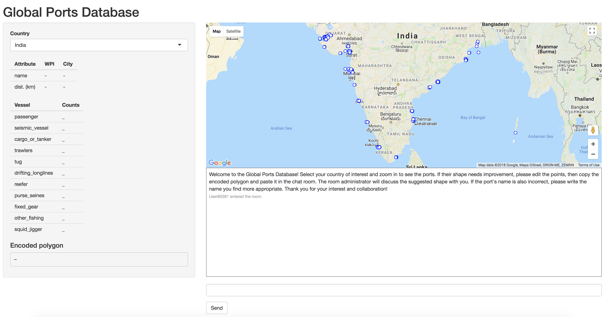
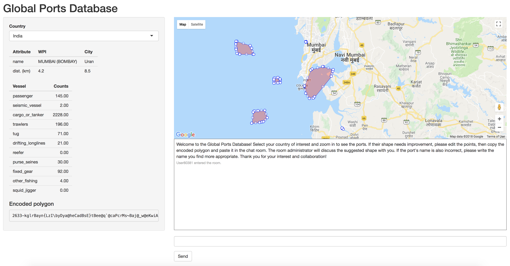
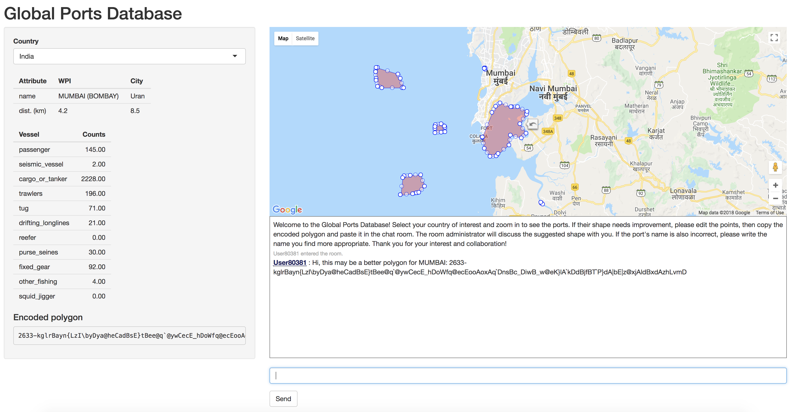

# shinyPorts 
## Shiny app to address challenge 9 of Fishackaton 2018 

\ 

**TL;DR** This package describes how to build the R Shiny app you can interact with at [https://rcsuite.shinyapps.io/shinyPorts/](https://rcsuite.shinyapps.io/shinyPorts/). The goal is to have an interactive app that lets users consult a database of ports (polygons) on a map, view their characteristics (name, types of vessels), and suggest improvements to the database over a chat room.

Part of challenge 9 of [Fishackathon 9](https://hackernest.com/events/san-francisco-usa-fishackathon-2018) was to develop "Tools for crowd-sourcing this solution [i.e., a method to cluster anchorages into ports and assign correct names and characteristics to them], including using publicly available databases, satellite imagery to aid in classification and naming." 

This open source R package attempts to do just that. It takes the port database developed with package [portsModel](https://github.com/rtlemos/portsModel) and deploys a Shiny web app on RStudio's server, 
[https://www.shinyapps.io](https://www.shinyapps.io), where it becomes available to anyone with access to the internet. The app displays a Google map, along with satellite imagery (activated by the yellow Peg Man). 

\ 

Users can click on ports and see some of their characteristics: nearest World Port Index (WPI) name and distance, nearest Geonames 1000 city name and distance, and Global Fishing Watch (GFW) counts of vessels that frequent the port. More WPI and Geonames 1000 are available but not displayed at the moment.

\ 

Crowd-sourcing of improvements to the ports databased may be possible through the chat room and the flexible mapping of ports. After zooming in to a given port, a user can see that the port is actually a polygon, not just a point. The polygon was based on the clustering of GFW anchorage data, meaning that it may not correspond to the actual, physical port. To correct this, the user can drag the points that make up the polygon, and notice that the encoded coordinates (`encoded polygon`) change accordingly. The user can then copy-paste the encoded polygon onto the chat room prompt, and send it over to the administrator, who will review the proposed shape. Users can also suggest new names for ports, as well as any enhancements to the database or UI. 

There's some work still to be done: once the administrator receives an encoded polygon, how can she compare it against the current version and update the database if she decides to accept it?